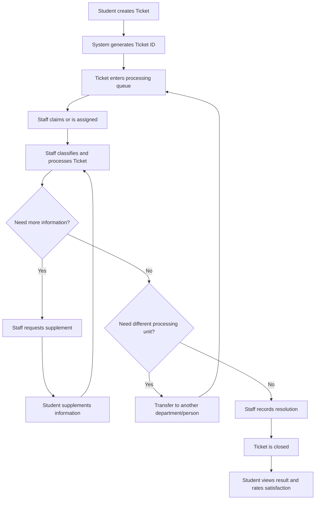

# Tổng quan nghiệp vụ hỗ trợ sinh viên

## 1. Phạm vi domain

Domain UniSupport xoay quanh một thực thể nghiệp vụ chính là **Ticket**. Ticket đại diện cho một yêu cầu hỗ trợ do sinh viên gửi tới Aurora University và được xử lý bởi nhân viên/phòng ban phù hợp.

Tài liệu domain chỉ mô tả sự thật nghiệp vụ và quy tắc vận hành. Chi tiết database, API, token, storage hoặc framework nằm trong `07-architecture`.

## 2. Nguyên tắc nghiệp vụ

| Nguyên tắc | Mô tả | Trạng thái |
| :--- | :--- | :--- |
| Định danh duy nhất | Mỗi yêu cầu hợp lệ được cấp một Ticket ID để theo dõi. | Baseline |
| Theo dõi trạng thái | Ticket có trạng thái rõ ràng từ lúc tạo đến lúc đóng. | Baseline |
| Phân định trách nhiệm | Ticket thuộc một phòng ban/phạm vi xử lý và có thể có một assignee khi được tiếp nhận/phân công. | Derived |
| Lưu lịch sử | Các thay đổi quan trọng được ghi lại để tra soát. | Baseline |
| Truy cập theo phạm vi | Người dùng chỉ xem/thao tác dữ liệu phù hợp với role và phạm vi liên quan. | Baseline |

## 3. Business process baseline

## 4. Business actors

| Actor | Vai trò trong process | Trạng thái |
| :--- | :--- | :--- |
| Student | Tạo Ticket, theo dõi, bổ sung thông tin, xem kết quả, đánh giá hài lòng. | Baseline |
| Staff | Tiếp nhận/phân công, phân loại, xử lý, yêu cầu bổ sung, chuyển xử lý, ghi nhận kết quả và đóng Ticket. | Baseline |
| Management | Theo dõi dashboard/báo cáo, workload, feedback; quản trị account và quyền theo phạm vi được cấp. | Baseline |
| System | Sinh Ticket ID, cập nhật/lưu lịch sử, phát thông báo nội bộ, kiểm tra quyền. | Derived |

## 5. Domain boundaries

- UniSupport quản lý yêu cầu hỗ trợ sinh viên dưới dạng Ticket.
- UniSupport không thay thế hệ thống đào tạo, kế toán, LMS hoặc CRM.
- UniSupport không tự động xử lý nghiệp vụ chuyên môn thay cho phòng ban; hệ thống hỗ trợ tiếp nhận, điều phối, theo dõi và ghi nhận kết quả.
- Việc tự động route Ticket tới phòng ban theo category chưa được proposal chốt; nếu triển khai, coi là **Derived/TBD** và cần cấu hình rõ.
