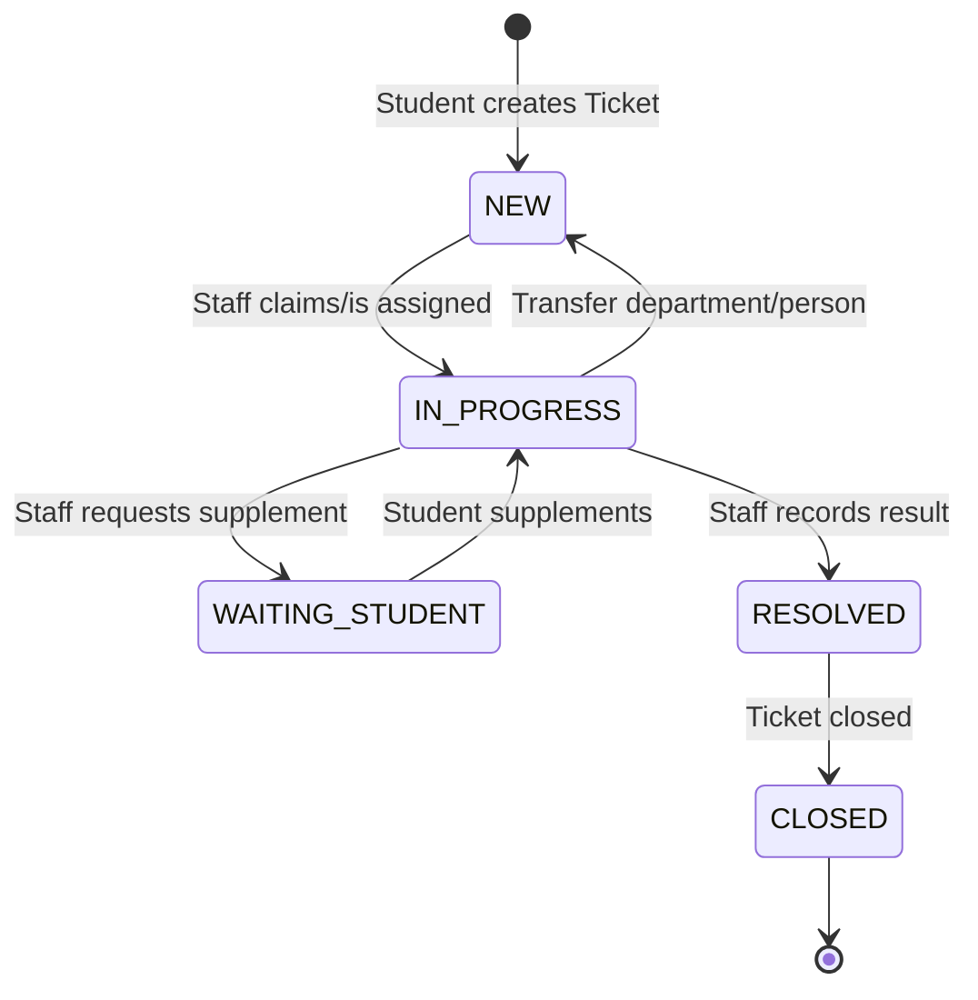

# Vòng đời Ticket

## 1. Lifecycle baseline

## 2. Ý nghĩa từng trạng thái

| Status | Ý nghĩa | Ai kích hoạt |
| :--- | :--- | :--- |
| `NEW` | Ticket mới được tạo hoặc quay lại hàng chờ sau khi transfer sang đơn vị xử lý khác. | Student / System |
| `IN_PROGRESS` | Ticket đã được Staff tiếp nhận hoặc được phân công. | Staff |
| `WAITING_STUDENT` | Staff cần Student bổ sung thông tin/giấy tờ. | Staff |
| `RESOLVED` | Staff đã ghi nhận kết quả xử lý. | Staff |
| `CLOSED` | Ticket được đóng/hoàn tất để Student xem kết quả và đánh giá. | Staff/System rule TBD |

## 3. Transfer rule

Baseline thống nhất khi transfer sang phòng ban/người phụ trách khác:

- Department/phạm vi xử lý được cập nhật sang đơn vị mới.
- Assignee hiện tại bị clear.
- Ticket quay về `NEW` để đơn vị mới tiếp nhận/phân công lại.
- Lịch sử transfer phải được lưu.

## 4. Proposed/TBD lifecycle extensions

| Extension | Trạng thái | Ghi chú |
| :--- | :--- | :--- |
| Cancel Ticket | Proposed/TBD | Proposal chưa nêu sinh viên hoặc hệ thống hủy Ticket. |
| Reopen Ticket | Proposed/TBD | Proposal chưa nêu mở lại Ticket sau khi resolved/closed. |
| Auto-close sau N ngày | Proposed/TBD | Proposal chưa chốt rule tự động đóng. |
| SLA pause khi `WAITING_STUDENT` | Proposed/TBD | Cần xác nhận cách tính SLA/KPI. |
